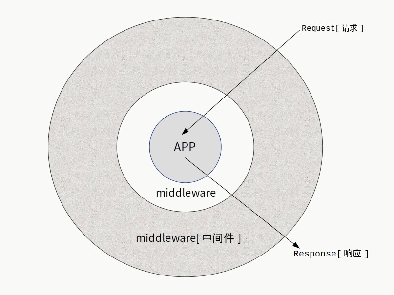

# titbit

> titbit是运行于服务端的Web框架，最开始是为了在教学中方便开发而设计，也用在一些业务系统上。它绝对算不上重型框架，但是也不简单过头。

Node.js的Web开发框架，同时支持HTTP/1.1和HTTP/2协议， 提供了强大的中间机制。


核心功能：

* 请求上下文设计。

* 中间件模式。

* 路由分组和命名。

* 中间件按照路由分组执行。

* 中间件匹配请求方法和路由来执行。

* 开启守护进程：使用cluster模块。

* 显示子进程负载情况。

* 默认解析body数据。

* 支持通过配置启用HTTP/1.1或是HTTP/2服务。

* 支持配置启用HTTPS服务（HTTP/2服务必须要开启HTTPS）。

* 限制请求数量。

* 限制一段时间内单个IP的最大访问次数。

* IP黑名单和IP白名单。

* 在cluster模式，监控子进程超出最大内存限制则重启。


框架在初始化会自动检测内存大小并设定相关上限，你可以在初始化后，通过更改secure中的属性来更改限制，这需要你使用daemon接口，也就是使用master管理子进程的模式。

```

var app = new titbit();

//最大内存设定为500M，但是只有在连接数为0时才会自动重启。
//这个值和diemem都是针对heap（堆）的。
app.secure.maxmem = 500000000;

//必须要重启的最大内存上限设定为600M
//这个值一般要比maxmem大，当内存使用超过maxmem设置的值，
//但是连接不为0，这时候如果继续请求超过diemem设置的值，则会直接重启进程。
app.secure.diemem = 600000000;

//最大内存使用设置为2G
//注意这是总的内存使用，包括你用Buffer申请的内存。

let workers = 2;
app.secure.maxrss = 2000000000 * workers;

app.get('/', async c => {
  c.send('ok');
})

app.daemon(8008, workers);

```

**注意，这需要你开启showLoadInfo选项，这是默认开启的，除非你设置为false**

在服务始化时，会根据系统的可用内存来进行自动的设置，除非你必须要自己控制，否则最好是使用默认的配置。


## !注意

请使用最新版本。

## 安装

```
npm i titbit
```

## 最小示例

``` JavaScript
'use strict';

const titbit = require('titibit');

var app = new titbit();

//router中的路由方法在app中都有同名的快速调用方法。
var {router} = app;

//也可以直接使用app.get
router.get('/', async c => {
  //data类型为string|Buffer
  //其等效形式为c.res.body = 'success';
  //同时可以设置c.res.encoding为返回数据的编码格式，默认为'utf8'。
  c.res.body = 'success'; //返回字符串
});

//默认监听0.0.0.0，参数和原生接口listen一致。
app.run(2019);

```

## 路由和请求类型

HTTP的起始行给出了请求类型，也被称为：请求方法。目前有8种请求方法：
```
GET POST PUT DELETE OPTIONS  TRACE HEAD PATCH
```

最常用的是前面5个。对于每个请求类型，router中都有同名但是小写的函数进行路由挂载。为了方便调用，在初始化app后，可以使用app上同名的快捷调用。

**示例：**

``` JavaScript

'use strict';

const titbit = require('titibit');

var app = new titbit({
  debug: true
});

app.get('/', async c => {
  c.res.body = 'success';
});

app.get('/p', async c => {
  c.res.body = `${c.method} ${c.routepath}`;
});

app.post('/', async c => {
  //返回上传的数据
  c.res.body = c.body;
});

app.put('/p', async c => {
  c.res.body = {
    method : c.method,
    body : c.body,
    query : c.query
  };
});

//默认监听0.0.0.0，参数和原生接口listen一致。
app.run(8080);

```


## 获取URL参数和表单数据

``` JavaScript
'use strict';

const titbit = require('titbit');

var app = new titbit();

var {router} = app;

router.get('/q', async c => {
  //URL中?后面的查询字符串解析到query中。
  c.res.body = c.query; //返回JSON文本，主要区别在于header中content-type为text/json
});

router.post('/p', async c => {
  //POST、PUT提交的数据保存到body，如果是表单则会自动解析，否则只是保存原始文本值，
  //可以使用中间件处理各种数据。
  c.res.body = c.body;
});

app.run(2019);

```

## 路由参数

``` JavaScript
app.get('/:name/:id', async c => {
  //使用:表示路由参数，请求参数被解析到c.param
  let username = c.param.name;
  let uid = c.param.id;
  c.res.body = `${username} ${id}`;
});
app.run(8000);
```

## 上传文件

默认会解析上传的文件，你可以在初始化服务的时候，传递parseBody选项关闭它，关于选项后面有详细的说明。
解析后的文件数据在c.files中存储，想知道具体结构请往下看。

``` JavaScript
'use strict';

const titbit = require('titbit');

var app = new titbit();

var {router} = app;

//添加中间件过滤上传文件的大小，后面有中间件详细说明。
//第二个参数表示只针对POST请求，并且路由命名为upload-image路由执行。
app.use(async (c, next) => {
  //解析后的文件在c.files中存储，通过getFile可以方便获取文件数据。
  let upf = c.getFile('image');
  if (!upf) {
    c.res.body = 'file not found';
    return ;
  } else if (upf.data.length > 2000000) {
    c.res.body = 'max file size: 2M';
    return ;
  }
  await next();

}, {method: 'POST', name: 'upload-image'});

router.post('/upload', async c => {
  let f = c.getFile('image');
  //此函数是助手函数，makeName默认会按照时间戳生成名字，extName解析文件的扩展名。
  let fname = `${c.helper.makeName()}${c.helper.extName(f.filename)}`;

  try {
    c.res.body = await c.moveFile(f, fname);
  } catch (err) {
    c.res.body = err.message;
  }
}, 'upload-image'); //给路由命名为upload-image，可以在c.name中获取。

app.run(2019);

```

## c.files数据结构

这种结构是根据HTTP协议上传文件时的数据构造设计的，HTTP协议允许同一个上传名有多个文件，所以要解析成一个数组。而使用getFile默认情况只返回第一个文件，因为多数情况只是一个上传名对应一个文件。

> 对于前端来说，上传名就是你在HTML中表单的name属性：&lt;input type="file" name="image"&gt;
> image是上传名，不要把上传名和文件名混淆。


```

{
  "image" : [
    {
      'content-type': CONTENT_TYPE,
      filename: ORIGIN_FILENAME,
      start : START,
      end   : END,
      length: LENGTH
    },
    ...
  ],

  "video" : [
    {
      'content-type': CONTENT_TYPE,  //文件类型
      filename: ORIGIN_FILENAME //原始文件名
      start : START, //ctx.rawBody开始的索引位置
      end   : END,   //ctx.rawBody结束的索引位置
      length: LENGTH,  //文件长度，字节数
    },
    ...
  ]
}
```
c.getFile就是通过名称索引，默认索引值是0，如果是一个小于0的数字，则会获取整个文件数组，没有返回null。


## 中间件

中间件是一个很有用的模式，不同语言实现起来多少还是有些区别的，但是本质上没有区别。中间件的运行机制允许开发者更好的组织代码，方便实现复杂的逻辑需求。事实上，整个框架的运行机制都是中间件模式。

中间件图示：



此框架的中间件在设计层面上，按照路由分组区分，也可以识别不同请求类型，确定是否执行还是跳过到下一层，所以速度非常快，而且多个路由和分组都具备自己的中间件，相互不冲突，也不会有无意义的调用。参考形式如下：

``` JavaScript

/*
  第二个参数可以不填写，表示全局开启中间件。
  现在第二个参数表示：只对POST请求方法才会执行，并且路由分组必须是/api。
  基于这样的设计，可以保证按需执行，不做太多无意义的操作。
*/
app.add(async (c, next) => {
    console.log('before');
    await next();
    console.log('after');
}, {method: 'POST', group: '/api'});

```

使用add添加的中间件是按照添加顺序逆序执行，这是标准的洋葱模型。为了提供容易理解的逻辑，提供use接口添加中间件，使用use添加的中间件按照添加顺序执行。不同的框架对实现顺序的逻辑往往会不同，但是顺序执行更符合开发者习惯。

**建议你最好只使用use来添加中间件。**


## pre 在接收body数据之前

使用pre接口添加的中间件和use添加的主要区别就是会在接收body数据之前执行。可用于在接收数据之前的权限过滤操作。其参数和use一致。

为了一致的开发体验，你可以直接使用use接口，只需要在选项中通过pre指定：

```
let setbodysize = async (c, next) => {
    //设定body最大接收数据为~10k。
    c.maxBody = 10000;
    await next();
};

//等效于app.pre(setbodysize);
app.use(setbodysize, {pre: true});

```

使用pre可以进行更复杂的处理，并且可以拦截并不执行下一层，比如doio-proxy利用这个特性直接实现了高性能的代理服务，并且只是框架的一个扩展。其主要操作就是在这一层，直接设置了request的data事件来接收数据，并作其他处理，之后直接返回。


## 配置选项

应用初始化，完整的配置选项如下

``` JavaScript
  {
    //此配置表示POST/PUT提交表单的最大字节数，也是上传文件的最大限制。
    maxBody   : 8000000,

    //最大解析的文件数量
    maxFiles      : 12,

    daemon        : false, //开启守护进程

    /*
      开启守护进程模式后，如果设置路径不为空字符串，则会把pid写入到此文件，可用于服务管理。
    */
    pidFile       : '',

    //是否开启全局日志，true表示开启，这时候会把请求信息输出或者写入到文件
    globalLog: false,

    //日志输出方式：stdio表示输出到终端，file表示输出到文件
    logType : 'stdio',

    //正确请求日志输出的文件路径
    logFile : '',

    //错误请求日志输出的文件路径
    errorLogFile : '',

    //开启HTTPS
    https       : false,

    http2   : false,

    //HTTPS密钥和证书的文件路径，如果设置了路径，则会自动设置https为true。
    key   : '',
    cert  : '',

    //服务器选项都写在server中，在初始化http服务时会传递，参考http2.createSecureServer、tls.createServer
    server : {
      handshakeTimeout: 7168, //TLS握手连接（HANDSHAKE）超时
      //sessionTimeout: 350,
    },

    //设置服务器超时，毫秒单位，在具体的请求中，可以再设置请求的超时。
    timeout   : 18000,

    debug     : false,

    //忽略路径末尾的 /
    ignoreSlash: true,

    //启用请求限制
    useLimit: false,

    //最大连接数，0表示不限制
    maxConn : 1024,

    //单个IP单位时间内的最大连接数，0表示不限制
    maxIPRequest: 0,

    //单位时间，默认为1秒
    peerTime : 1,
    
    //展示负载信息，需要通过daemon接口开启cluster集群模式
    showLoadInfo : true,

    //负载信息的类型，text 、json、--null
    //json类型是给程序通信使用的，方便接口开发
    loadInfoType : 'text',

    //负载信息的文件路径，如果不设置则输出到终端，否则保存到文件
    loadInfoFile : '',

    //404要返回的数据
    notFound: 'Not Found',
    
    //400要返回的数据
    badRequest : 'Bad Request',

    //控制子进程最大内存使用量的百分比参数，范围从-0.42 ～ 0.36。基础数值是0.52，所以默认值百分比为80%。
    memFactor: 0.28

  };
  // 对于HTTP状态码，在这里仅需要这两个，其他很多是可以不必完整支持，并且你可以在实现应用时自行处理。
  // 因为一旦能够开始执行，就可以通过运行状态返回对应的状态码。
  // 而在这之前，框架还在为开始执行洋葱模型做准备，不过此过程非常快。

```

## 请求上下文

请求上下文就是一个封装了各种请求数据的对象。通过这样的设计，把HTTP/1.1 和 HTTP/2协议的一些差异以及Node.js版本演进带来的一些不兼容做了处理，出于设计和性能上的考虑，对于HTTP2模块，封装请求对象是stream，而不是http模块的IncomingMessage和ServerResponse（封装对象是request和response）。

``` JavaScript

    var ctx = {

      version : '1.1', //协议版本
      
      maxBody : 0, //最大body请求数据量

      method    : '', //请求类型

      ip      : '', //客户端IP

      host    : '', 
      
      port    : 0,
      
      protocol: '', //协议

      //实际的访问路径
      path    : '',

      name    : '', //对路由和请求的命名
      
      headers   : {},

      //实际执行请求的路径，是添加到路由模块的路径
      routepath   : '', 

      //路由参数
      param     : {},

      //url的querystring参数，就是url 的 ? 后面的参数
      query     : {},

      //请求体解析后的数据
      body    : {},

      //是否是上传文件的操作
      isUpload  : false,

      //路由分组
      group     : '',
      
      //原始body数据
      rawBody   : '',

      //body数据接收到的总大小
      bodyLength  : 0,

      //解析后的文件信息，实际的文件数据还在rawBody中，这里只记录信息。
      files     : {},

      // 指向实际请求的回调函数，就是通过app.get等接口添加的回调函数。
      // 你甚至可以在执行请求过程中，让它指向一个新的函数，这称为请求函数重定向。
      requestCall : null,

      //助手函数，包括aes加解密、sha1、sha256、sha512、格式化时间字符串、生成随机字符串等处理。
      helper    : helper,

      //要返回数据和编码的记录
      res : {
        body : '',
        encoding : 'utf8',
      },
  
      //http模块请求回调函数传递的参数被封装到此。
      //在http2协议中，没有这两项。
      request   : null,
      response  : null,

      //只有在http2模块才有此项。
      stream : null,
  
      //中间件执行时挂载到此处的值可以传递到下一层。
      box : {},

      //app运行时，最开始通过addService添加的服务会被此处的service引用。
      //这称为依赖注入，不必每次在代码里引入。
      service:null,
    };

    ctx.send = (d) => {
      ctx.res.body = d;
    };

    ctx.getFile = (name, ind = 0) => {
      if (ind < 0) {return ctx.files[name] || [];}
  
      if (ctx.files[name] === undefined) {return null;}
      
      if (ind >= ctx.files[name].length) {return null;}
  
      return ctx.files[name][ind];
    };
  
    ctx.setHeader = (name, val) => {
      ctx.response.setHeader(name, val);
    };
 
    //不使用getter和setter是因为其性能比函数调用差很多
    ctx.status = (stcode = null) => {
      if (stcode === null) { return ctx.response.statusCode; }
      if(ctx.response) { ctx.response.statusCode = stcode; }
    };

    //上传文件时，写入数据到文件的助手函数。
    /**
     * @param {object} upf 通过ctx.getFile获取的文件对象
     * @param {string} target 目标文件路径，包括路径和文件名。
    */
    ctx.moveFile = (upf, target) => {
      return moveFile(ctx, upf, target);
    };

```

注意：send函数只是设置ctx.res.body属性的值，在最后才会返回数据。和直接进行ctx.res.body赋值没有区别，只是因为函数调用如果出错会更快发现问题，而设置属性值写错了就是添加了一个新的属性，不会报错但是请求不会返回正确的数据。

## 依赖注入

请求上下文中有一项是service，指向的是app.service。当初始化app后，一切需要开始就初始化好的数据、实例等都可以挂载到app.service。

``` JavaScript

'use strict';

const titbit = require('titbit');

var app = new titbit({
  debug: true
});

//有则会覆盖，没有则添加。
app.addService('name', 'first');
app.addService('data', {
  id : 123,
  ip : '127.0.0.1'
});

/*
这可能看不出什么作用，毕竟在一个文件中，直接访问变量都可以，如果要做模块分离，就变得非常重要了。
*/
app.get('/info', async c => {

  c.res.body = {
    name : c.service.name,
    data : c.service.data
  };

});

app.run(1234);

```
