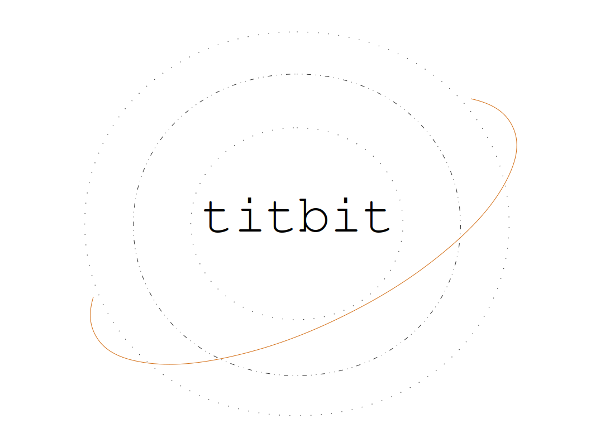

# titbit

目前正在开发的Web框架，总结之前的开发经验，这次想把之前的一些想法综合起来，同时支持HTTP/1.1和HTTP/2协议。

现在已经可用，正在经历比较完整的测试。中间件模式做了扩展支持按照请求类型执行。抽离出了请求过滤、全局日志模块，方便维护和替换。

路由和解析body数据也改成了中间件模式，但是框架会有默认启用并提供了设置项。

核心功能：

* 中间件模式
* 路由分组/中间件按照路由分组执行
* 中间件匹配请求方法和路由来执行
* 开启守护进程：使用cluster模块
* 显示子进程负载情况
* 提供了解析body数据模块
* 支持通过配置启用HTTP/1.1或是HTTP/2服务
* 支持配置启用HTTPS服务（HTTP/2服务必须要开启HTTPS）

中间件是一个很有用的模式，不同语言实现起来多少还是有些区别的，这个框架采用了一个有些不同的设计，并没有参考其他代码，当初是独自设计出来的，在middleware模块，目前来说运行还很好，如果有问题，也请不吝赐教。

此框架的中间件设计需要next中传递请求上下文参数，除此以外，其他使用都没有任何区别，在设计层面上，并不是动态生成的，而是在一开始就已经确定了执行链条，并且按照路由分组区分开来，也可以识别不同请求类型和路由确定是否执行还是跳过到下一层，只要请求过来就马上开始执行，所以速度非常快。参考形式如下：

``` JavaScript

/*
  第二个参数可以不填写，表示全局开启中间件。
  现在第二个参数表示：只对POST请求方法才会执行，并且路由分组必须是/api。
  基于这样的设计，可以保证按需执行，不做太多无意义的操作。
*/
app.add(async (c, next) => {
    console.log('before');
    await next(c);
    console.log('after');
}, {method: 'POST', group: '/api'});

```

